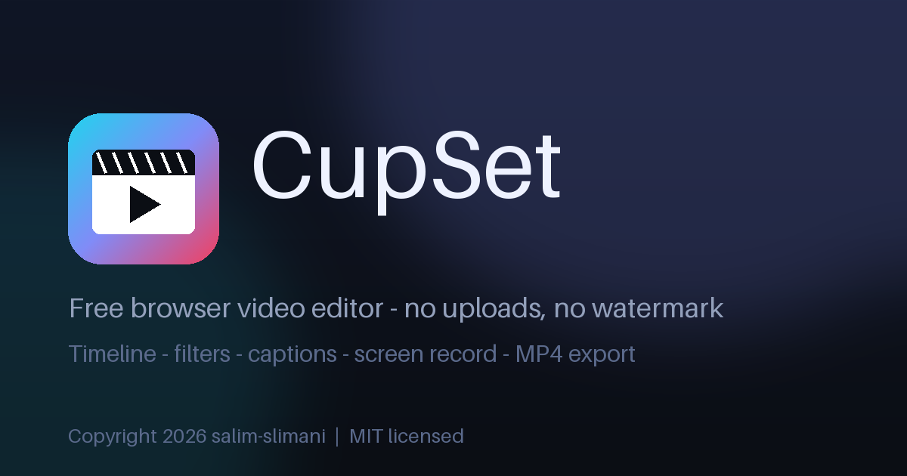

<p align="center">
  
</p>

# 🎬 CupSet

<p align="center"><strong>Free, professional video editing right in your browser.</strong></p>

<p align="center">
  
</p>

CupSet is a fast, lightweight, fully client-side video editor. No installs, no uploads, no watermarks — your footage never leaves your device.

## ✨ Features

- **Multi-track timeline** — video, image, audio, text & shape tracks with drag, trim, split and ripple-friendly editing
- **Real-time preview** — single-loop Canvas2D renderer, GPU-composited by the browser
- **Filters & color** — brightness, contrast, saturation, blur, grayscale, hue-rotate
- **Animated text** — fade, typewriter, slide, pop + SRT caption import + lower thirds
- **Audio mixing** — per-clip volume & speed, track mute / lock / hide
- **Transitions** — per-clip fade in / out
- **Screen recording** — built-in capture straight to the timeline
- **Export MP4 / WebM** — hardware-friendly `MediaRecorder` pipeline, 720p → 1080p → max quality
- **Project files** — save / open as JSON, autosave every 8s, unlimited undo / redo
- **Shortcuts** — `Space` play, `S` split, `Del` delete, arrows step frame-by-frame, `Ctrl+Z` undo

## 🚀 Quick start

```bash
git clone https://github.com/salim-studio/cupset.git
cd cupset
npm install
npm run dev
# open http://localhost:5174
```

## 📦 Production build

```bash
npm run build
npm run preview
```

## 🌍 Browsers

Chrome / Edge 94+ ✅ — Firefox 130+ ✅ — Safari 16.4+ ✅

## 🛠 Tech

React 18 · TypeScript · Zustand · Vite · Canvas2D · Web Audio · MediaRecorder — zero heavy 3D deps, ~180 KB bundle.

## 📄 License

MIT — © 2026 salim-slimani. Free for personal and commercial use.
